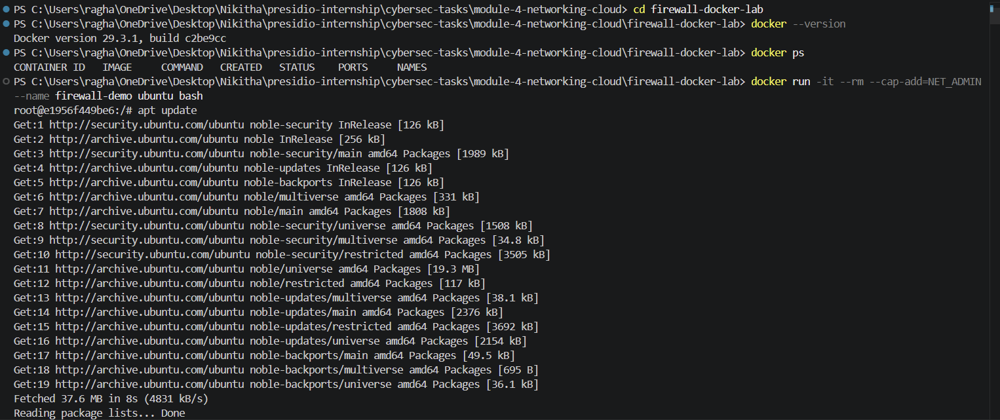
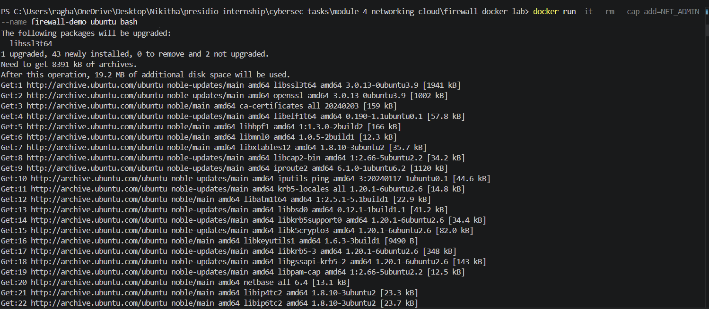
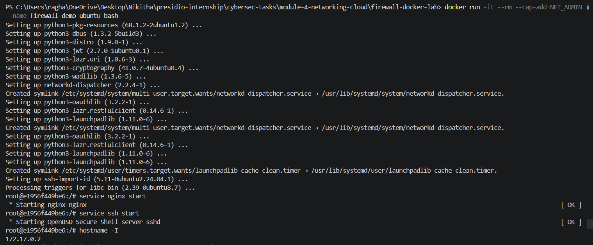
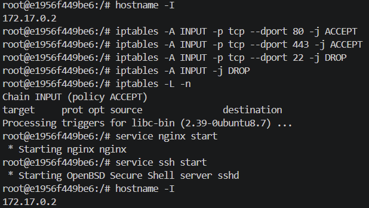
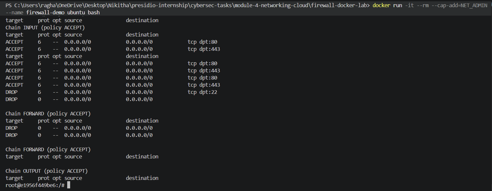
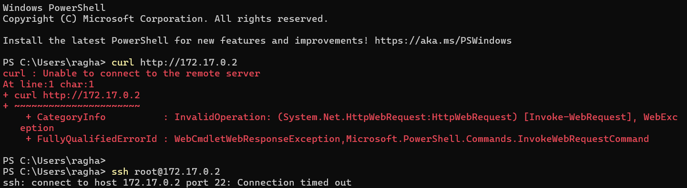

# Firewall Lab Observations

## Environment Setup

- Docker container (Ubuntu) was successfully created
- Installed required tools: iptables, nginx, openssh-server
- Started services:
  - nginx (port 80)
  - ssh (port 22)

---

## Firewall Configuration

Applied the following rules:

- Allowed HTTP (port 80)
- Allowed HTTPS (port 443)
- Blocked SSH (port 22)
- Dropped all other traffic

---

## Verification of Rules

Command used:

iptables -L -n

Observed:

- ACCEPT rule for port 80
- ACCEPT rule for port 443
- DROP rule for port 22
- Default DROP for all other traffic

---

## Testing Results

### HTTP Test

- Command: curl http://172.17.0.2  
- Result: Failed to connect  

Reason:
- Docker internal IP is not accessible from Windows host  

---

### SSH Test

- Command: ssh root@172.17.0.2  
- Result: Connection timed out  

Conclusion:
- SSH port (22) successfully blocked by firewall  

---

## Additional Verification (Inside Container)

Command:

curl http://localhost

Result:
- Nginx welcome page displayed successfully  

Conclusion:
- HTTP service is running correctly inside container  

---

## Output Screenshots

### 1. Container Running

---

### 2. Package Installation

---

### 3. Services Started

---

### 4. Firewall Rules

---

### 5. HTTP Working Inside Container

---

### 6. SSH Blocked and HTTP Failed

---

## Final Conclusion

- Successfully simulated Linux firewall using Docker and iptables  
- Allowed only HTTP (80) and HTTPS (443)  
- Blocked SSH (22) as required  
- Verified rules using iptables and connection tests  
- Demonstrated working firewall behavior in an isolated environment  